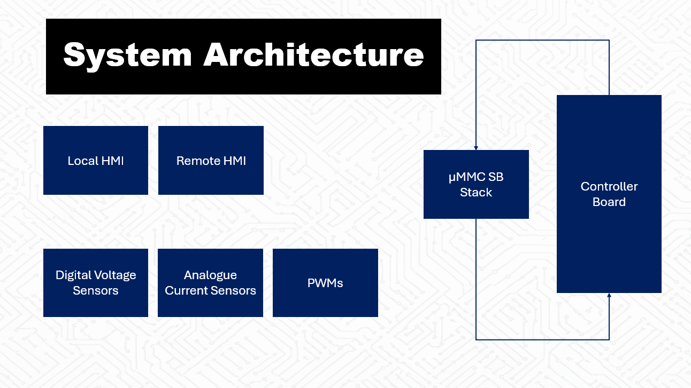
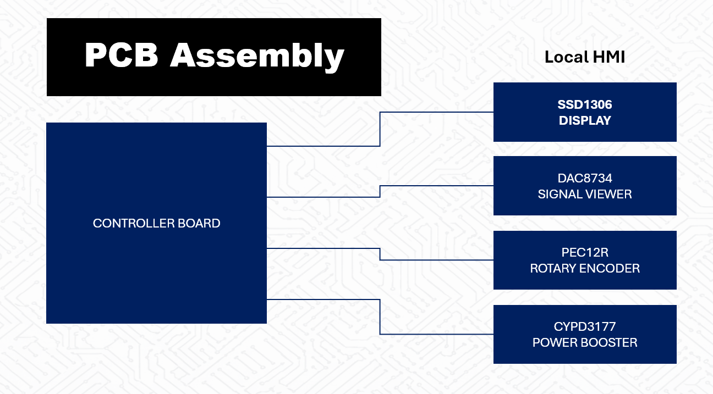
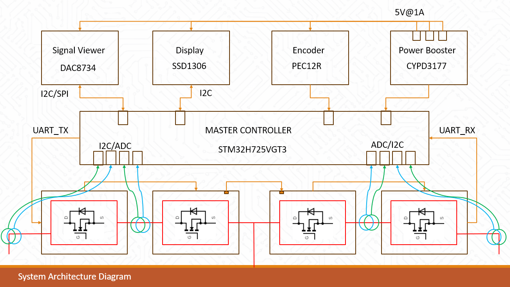
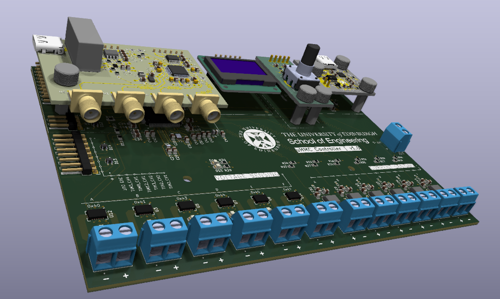

# Laboratory MMC controller

This system drives series-connected stack topologies. The core of the system is the controller board that implements STM32 for flow control and data processing. The board provides local and remote HMI, monitoring points for voltage and current, and additional functions such as PWM channels or a power supply terminal.

The system provides extended functionality through additional shields, such as a data acquisition shield for producing or reconstructing digital signals, a power supply board, and an encoder and display for local user input.

Functions: 
- Submodule UART Link 
- USB Data Link
- Voltage Monitoring 
- Current Monitoring 

Additional Functions: 
- PWM Channels
- 5V/3V3 Power Sources

PCB Shields: 
- Data Acquisition (signal viewer)
- Power Supply (power booster)
- Encoder 
- Display

## Simple System Architecture

## PCB Assembly

## Detailed System Architecture

## Real System View

## Model System View
